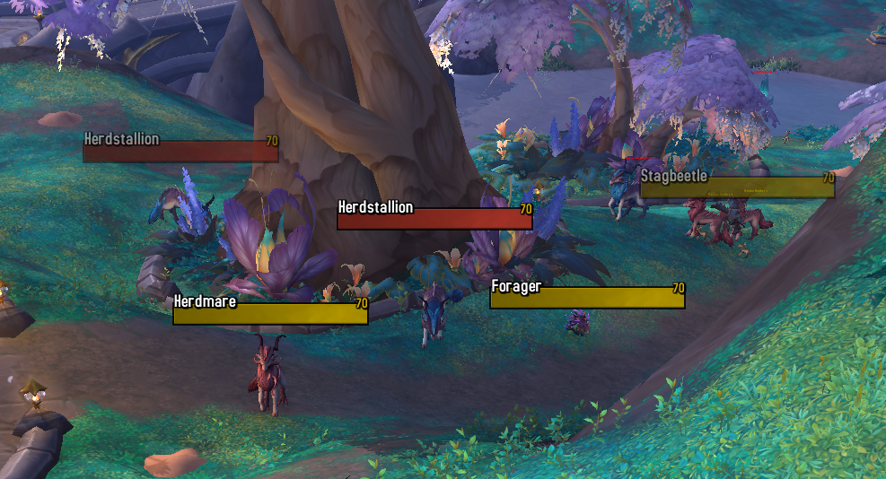
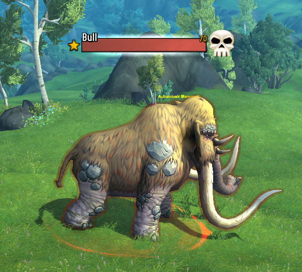
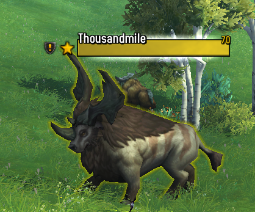
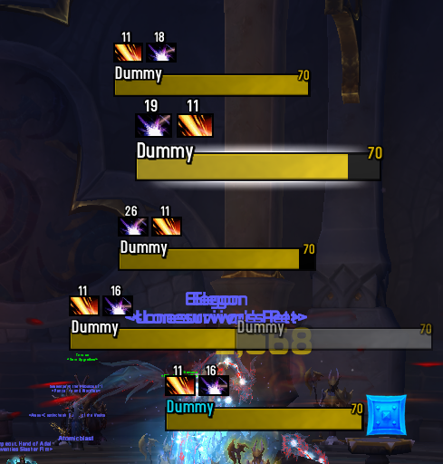
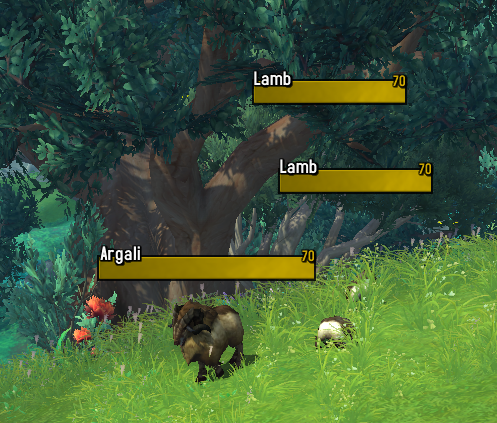

# Berzek's Plates





## Instalation
Copy [plater.conf](plater.conf) content in to plater as a profile import.

> Type `'/plater'` to open the configuration.

```bash
Profiles > Import Profile > 'Paste import string here' > Okay
```

# Tuning the profile

## 1. Scaling

Inside plater configuration, set the proper scale for you particular interface.

```bash
Level & Strata > Scaling > Fine Tune Scale
```

Adjust this setting until you find the perfect size.

## 2. Buffs & Debbufs


Currently the profile only shows pre configured debuffs on the target. This is mainly to avoid unnecesary information on your plates.

If you need to add custom debuffs open plater configuration:
```bash
Buff Tracking > Add Debuff box > 'Set name or id of the spell you want to track' > Add Debuff
```

> Sometimes when you just type the spell name it doesn't show the correct debuffs so i recommend using the spell id. The easiest way to get it right is to download an addon called [idTip](https://www.curseforge.com/wow/addons/idtip). It will display the spell id on the tooltip of the spell.

> Also, you can customize the size of the debuffs under `Buffs Settings > Aura Size (Frame 1)`. 

## 3. Minor / Pets


Minor and pets (include totems) are configured to be only a 70% of the total width. You can customize this in Plater configuration and set the width/height.

```bash
Advanced > Special Units
```