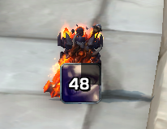
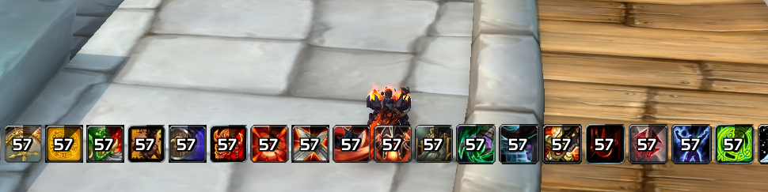
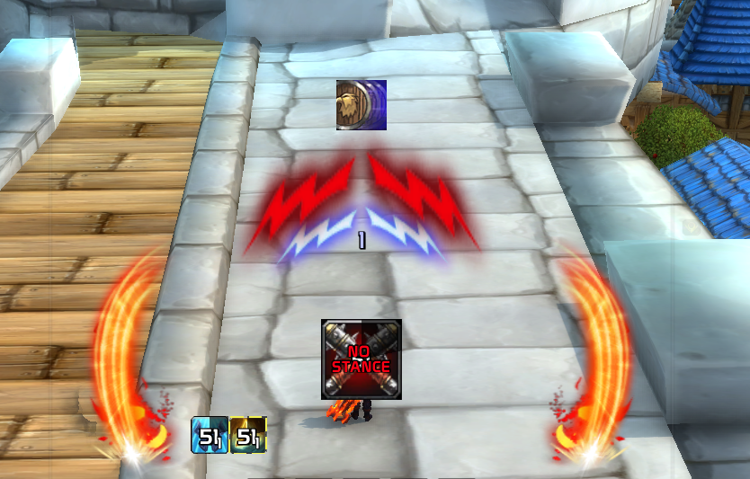
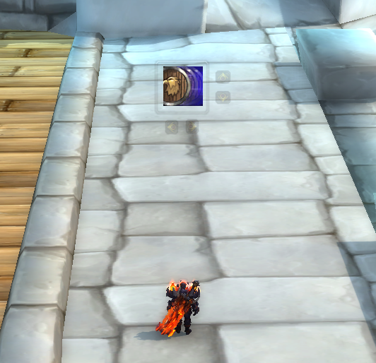

# Auras

## Important Cds

This aura is a dynamic group that displays importat buffs. Offensive or defensive cds, personal or external like from your healer/warrior/dh/etc.

## Warrior
### Custom Abilities
This aura tracks trinket procs, Overpower, Mortal Strike and Execute usage so you don't have to look up for your bars to do maximum damage.

### Warrior cds

This aura tracks your spell cds and it shows on the screen the icon when they are ready. Also plays a sound for offensive cds like warbreaker and bladestorm so you can keep up the pressure easily.

